# BloggyPost – Role-Based Blog Web Application

---

# Project Name

**BloggyPost – Role-Based Blog Web Application**

---

# Project Overview

BloggyPost is a role-based blog web application developed using **React JS**, **Vite**, **JSON Server**, and **Bootstrap 5**. The application demonstrates role-based access control by providing separate functionalities for Visitors, Authors, and Administrators.

Visitors can browse blogs, filter blogs by category and author, read complete blog articles, and post comments. Authors can register, log in, create and manage their own blogs, update or delete published articles, and read comments received on their blogs. Administrators have complete control over the platform, including managing all blogs, editing any blog, managing registered authors, and monitoring the overall content.

The application follows a component-based architecture, uses REST APIs through JSON Server for data management, and implements protected routing using React Context to secure role-based pages.

---

# Tech Stack

### Frontend
- React JS
- Vite
- Bootstrap 5
- Bootstrap Icons
- CSS3

### Backend (Mock API)
- JSON Server

### API Communication
- Axios

### Routing
- React Router

### State Management
- React Context API

### Animation
- AOS (Animate On Scroll)

### Development Tools
- Visual Studio Code
- Git
- GitHub

---

# Features in the Project

## General Features

- Responsive user interface built with Bootstrap 5
- View all published blogs
- View complete blog details
- Filter blogs by category
- Filter blogs by author
- Responsive navigation bar and footer
- Custom 404 Page
- Scroll-to-top functionality

---

## User Features

- Browse blogs without logging in
- Read complete blog articles
- Filter blogs by category and author
- Add comments on blog posts

---

## Author Features

- Author Registration
- Author Login
- Protected Author Dashboard
- Create new blogs
- View own blogs
- Edit own blogs
- Delete own blogs
- Filter own blogs by category
- Read comments received on published blogs

---

## Admin Features

- Admin Login
- Protected Admin Dashboard
- View all blogs
- Edit any blog
- Delete any blog
- Manage all registered authors
- Edit author details
- View author information
- Search authors
- Monitor platform statistics

---

## Technical Features

- Role-based authentication using React Context API
- Protected Routes for Author and Admin modules
- REST API integration using Axios
- CRUD operations using JSON Server
- Dynamic routing using React Router
- Component-based architecture
- Responsive design for desktop, tablet, and mobile devices

---

# My Role in This Project

**Frontend Developer**

### Responsibilities

- Designed the complete user interface using React JS and Bootstrap 5.
- Developed reusable React components following a modular folder structure.
- Implemented role-based authentication using React Context API.
- Built protected routes for Author and Admin modules.
- Integrated JSON Server REST APIs using Axios.
- Developed CRUD functionality for blog management.
- Implemented blog filtering by category and author.
- Developed dynamic Blog Details pages.
- Built Author Dashboard for managing personal blogs.
- Built Admin Dashboard for managing blogs and authors.
- Implemented comment functionality for blog posts.
- Designed responsive layouts for all pages.
- Implemented navigation, routing, and error handling.
- Organized the project using a clean and beginner-friendly folder structure.

---

# Screenshots of Different Web Pages

> **(Add screenshots here after completing the project.)**

## Home Page

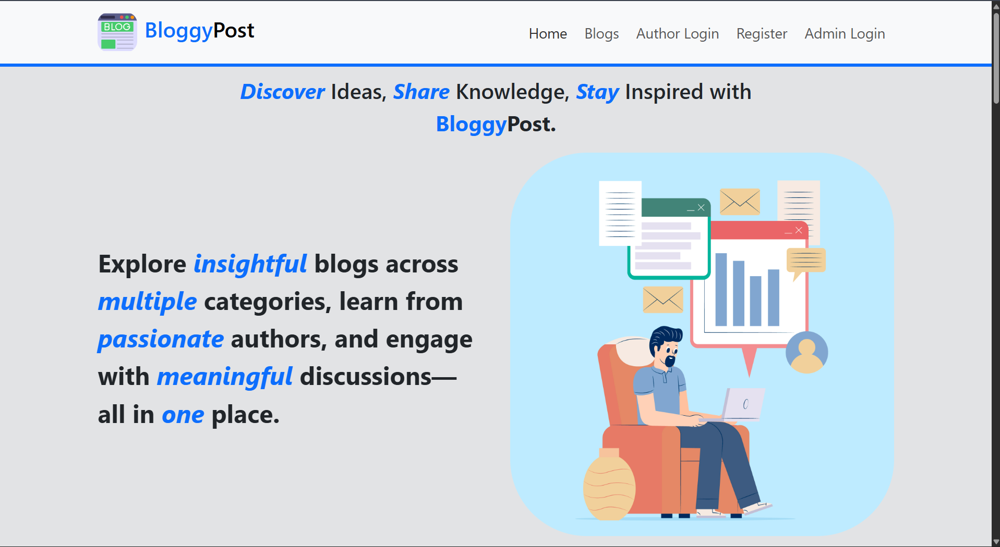

---

## Blogs Page

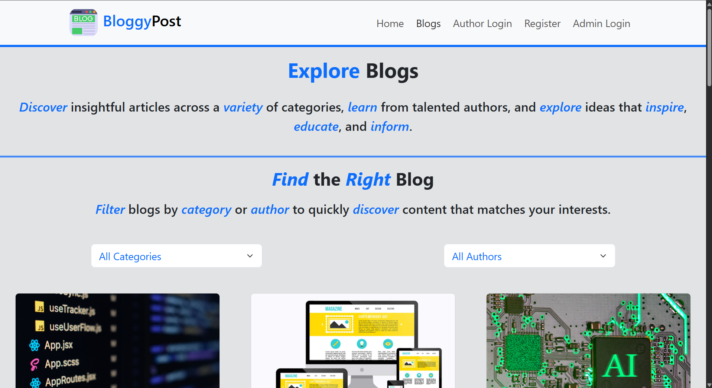

---

## Blog Details Page

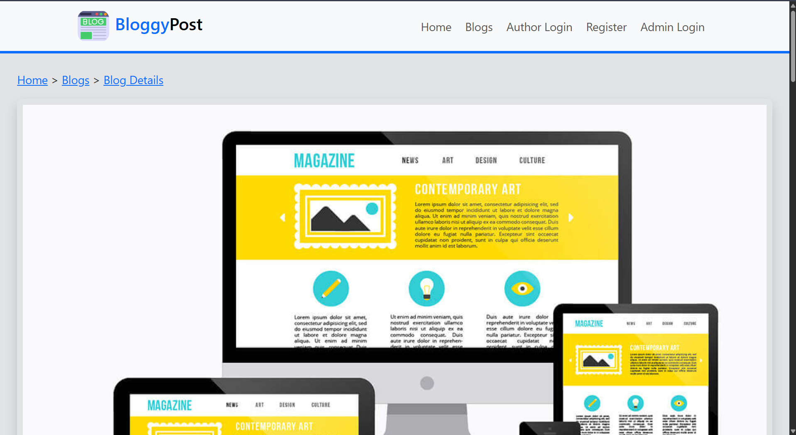

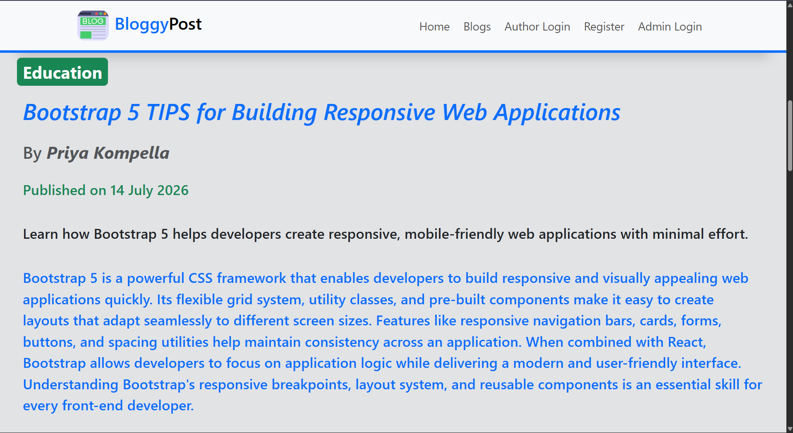

---

## Author Login Page

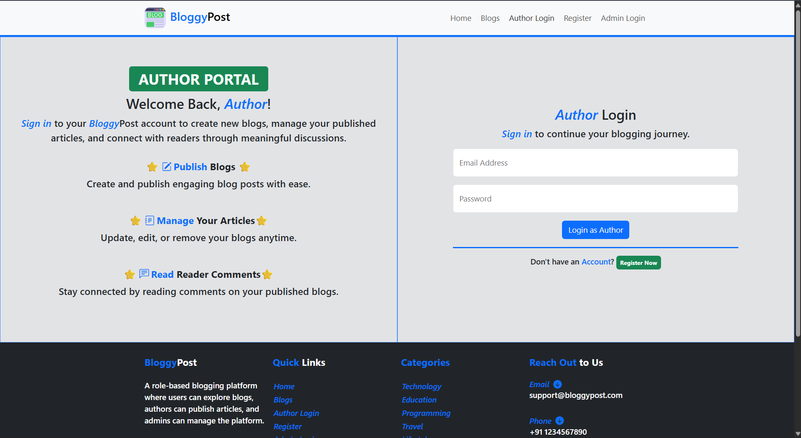

---

## Author Registration Page

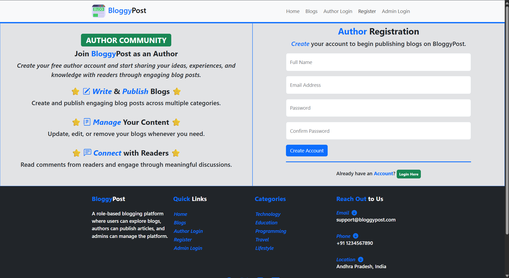

---

## Author Dashboard

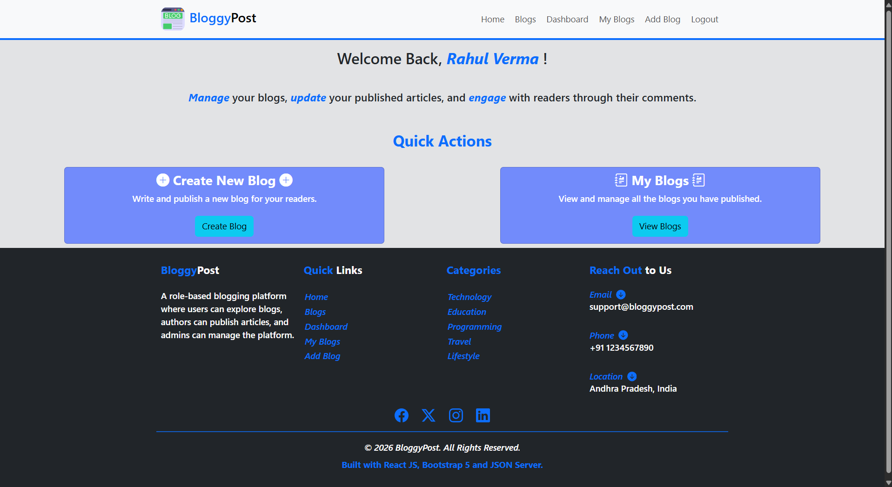

---

## Add Blog Page

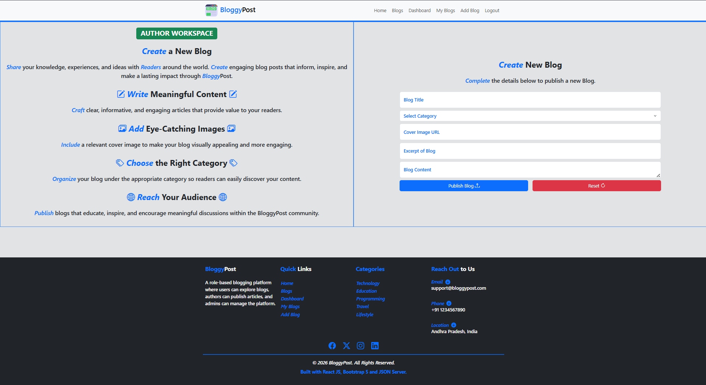

---

## My Blogs Page

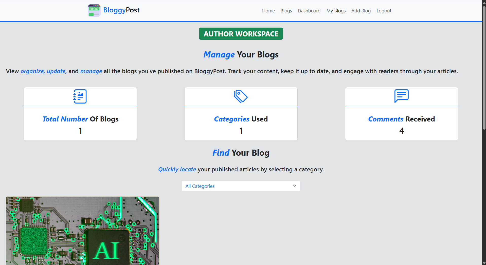

---

## Edit Blog Page

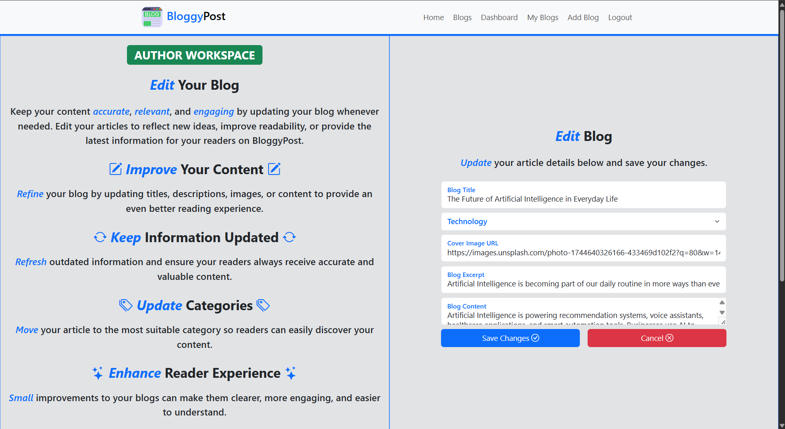

---

## Admin Login Page

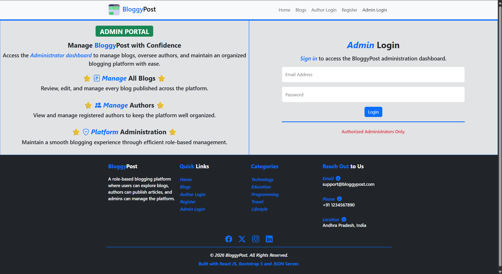

---

## Admin Dashboard

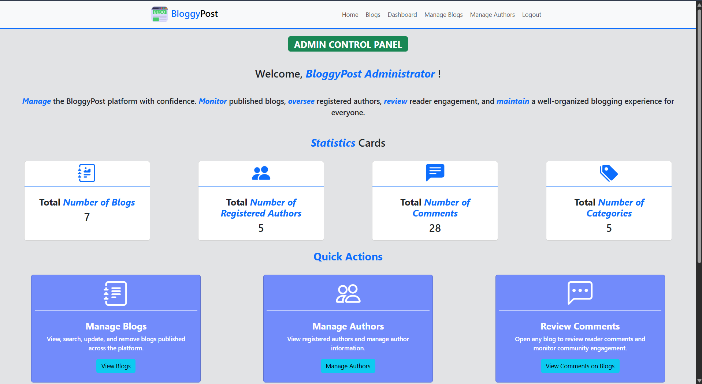

---

## 404 Not Found Page

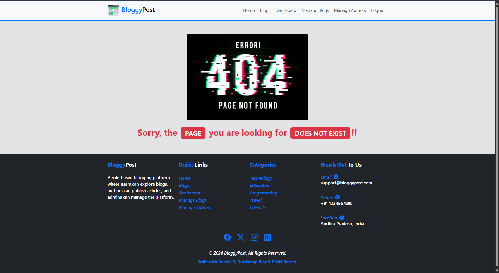
